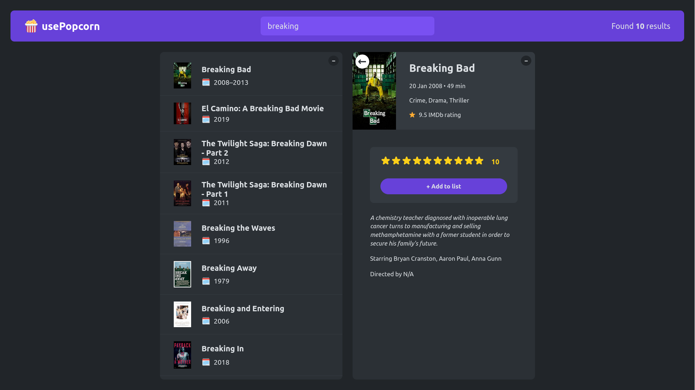

# 🍿 usePopcorn

<div align='center'>

  


</div>



Click to view the [demo](https://usepopcorn-imad.netlify.app/)

## Description

usePopcorn lets users search for movies/TV-series, view detailed information, and manage their watch history

## Features

- Search Functionality:
   - Users can enter a movie title in the search box and press Enter to see results. 🔍
   - The search box is automatically focused when the page loads. 🎯
   - Users can press Enter to clear the search query after input. ⌨️
   
- Search Results Display:
   - Movie titles and release years are displayed. 🎥📅
   - Users can click on a movie to view more details. 👆
   - Detailed search results include the title, poster, runtime, IMDb rating, plot, release year, actors, director, and genre. 📝🎬

- Page Title Update:
   - The page title is automatically updated to the selected movie title. 📑

- Rating and Watchlist Management:
   - Users can rate movies (1 to 10) and add them to their watchlist. ⭐️📝
   - The watchlist is automatically persisted in local storage. 💾
   - Users can remove movies from their watchlist by clicking the ❌ button next to the movie. 

- Navigation:
   - Users can press the Escape key to return from the search results detail page to the watchlist. ⏪


## Technologies Used

- React
- JavaScript
- HTML
- CSS
- OMDb API
- VITE


## Installation

To run this project locally, you can follow these steps:

1. Clone the repository:
   ```
   $ https://github.com/imadosan/usePopcorn.git
   ```
2. Open the project folder in your code editor of choice.
3. Install dependencies and packages
   ```
   $ npm install
   ```
4. Run the application
   ```
   $ npm run dev
   ```


